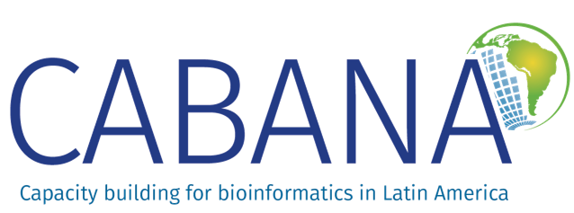

# CABANAnet: Entrenamiento para instructores

**Instructores:**

-   **Evelia Coss** - Postdoctoral LIIGH, VieRnes de Bioinformática en el LIIGH-UNAM, RSG México y Rladies Morelia. Instructora certificada de Carpentries. [Web page](https://eveliacoss.github.io/)
-   **Miguel Angel Magaña Lemus** - Tecnico CCM-UNAM, Instructor certificado de Carpentries.
-   **Domingo Martinez** - Postdoctoral LIIGH-UNAM, Profesor de Asignatura ENES-UNAM. Ayudantes Johanna Castelán - RSG México y Rladies Morelia Marisol Navarro - RSG México

**Máximo número de participantes:** 15

**Duración:** 16 horas (8 horas diarias)

**Idioma:** Español

**Fechas**: 28 al 30 de abril de 2025

**Sede:** Laboratorio Internacional de Investigación sobre el Genoma Humano (LIIGH-UNAM), Juriquilla, Querétaro, México. [Mapa](https://www.google.com/maps/place/Laboratorio+Internacional+de+Investigaci%C3%B3n+sobre+el+Genoma+Humano+(LIIGH)+UNAM/data=!4m2!3m1!1s0x0:0xde7120fbed54624f?sa=X&ved=1t:2428&ictx=111) 🏢

### **Descripción** 📌

El evento CABANAnet: Entrenamiento para Instructores está diseñado para capacitar a los **futuros instructores en el uso de la red CABANAnet**, un recurso clave para la enseñanza de bioinformática y herramientas computacionales en la ciencia. A través de este entrenamiento, los participantes aprenderán a utilizar la plataforma, explorar sus características y métodos pedagógicos, y desarrollar habilidades para enseñar a otros de manera efectiva, promoviendo un aprendizaje inclusivo y accesible en el ámbito de la bioinformática.

### **Objetivo** 📍

Capacitar a los participantes en el uso y enseñanza de CABANAnet, brindándoles las herramientas necesarias para **impartir formación efectiva y promover el aprendizaje interactivo en bioinformática**, asegurando la transferencia de conocimientos y el fortalecimiento de la red de instructores.

Este entrenamiento proporcionará:

-   Orientación sobre técnicas generales de capacitación y el uso adecuado de métodos pedagógicos, centrados en las necesidades de los participantes, junto con consejos prácticos para garantizar una capacitación exitosa.

-   Un marco para el diseño curricular efectivo y su posterior desarrollo, que permitirá a los futuros instructores crear y adaptar cursos alineados con las necesidades de su alumnado.

-   Oportunidades para practicar la entrega de capacitación virtual, fomentando la interacción y aprendizaje a distancia de manera efectiva.

### **Enfoque de la audiencia**

Este entrenamiento está orientado a personas con un fuerte **interés en la docencia**, especialmente aquellas que buscan fortalecer sus habilidades para enseñar **bioinformática**. 

### **Pre-requisitos**

Se recomienda a los participantes que:

-   Estén cursando un posgrado o tengan varios años de experiencia en investigación o educación universitaria.
-   Se encuentren trabajando en una institución latinoamericana y se prevea que permanezcan en ella al menos durante el próximo año.
-   Tengan un gran interés en la enseñanza y hayan participado previamente en programas de formación.
-   Hayan identificado una necesidad o brecha en la cual pueden ofrecer capacitación y ya hayan reflexionado sobre el tipo de formación que desean brindar.

## **Materiales** 🌱

Durante el curso, utilizaremos una variedad de recursos, que incluyen materiales prácticos y teóricos para el desarrollo de habilidades de enseñanza en bioinformática. Entre los principales materiales se encuentran los proporcionados por [MetaDocencia y CABANAnet](https://www.metadocencia.org/curso/entrenamiento-instructores/), [The Capentries](https://carpentries.github.io/instructor-training/) y [Rstudio Education](https://education.rstudio.com/trainers/#info).

## **Citar y reutilizar el material del curso**

Los datos del curso se pueden reutilizar y adaptar libremente con la debida atribución. Todos los datos de los cursos de estos repositorios están sujetos a la licencia [Attribution-NonCommercial-ShareAlike 4.0 International (CC BY-NC-SA 4.0)](https://creativecommons.org/licenses/by-nc-sa/4.0/).
